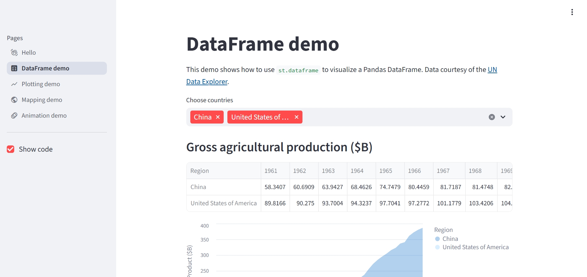

# **COVID-19 Research Analysis Dashboard**

## **Project Overview**

This project provides an **interactive analysis of COVID-19 research papers** using the **CORD-19 dataset**. The main goal is to explore trends in research publications, identify top journals, and create a **dynamic web dashboard** to present insights in a user-friendly way.

This assignment demonstrates **data cleaning, visualization, and web application development skills** suitable for beginners and intermediate Python users.

---

## **Features**

- Load and clean **real-world COVID-19 research data** (`metadata.csv`).
- Interactive **Streamlit dashboard** to filter papers by year.
- Visualizations include:

  - Number of publications per year.
  - Top 10 journals publishing COVID-19 research.

- Preview of sample papers including **title, authors, journal, and year**.
- Professional and visually appealing plots using **Matplotlib** and **Seaborn**.

---

## **Dataset**

- The dataset used is **`metadata.csv`** from the [CORD-19 Research Challenge](https://www.kaggle.com/allen-institute-for-ai/CORD-19-research-challenge).
- It contains metadata for COVID-19 research papers:

  - Paper titles and abstracts
  - Authors and journals
  - Publication dates
  - Source information

> **Note:** Only a sample of the dataset is used for this assignment to simplify analysis.

---

## **Technologies Used**

- **Python 3.13** – Data processing and scripting
- **Pandas** – Data manipulation and cleaning
- **Matplotlib & Seaborn** – Data visualization
- **Streamlit** – Interactive web dashboard
- **Jupyter Notebook (optional)** – For exploration and testing

---

## **Installation & Setup**

1. Clone the repository:

```bash
git clone <your-repo-url>
cd Frameworks_Assignment
```

2. Install required Python packages:

```bash
python -m pip install --upgrade pip
python -m pip install pandas matplotlib seaborn streamlit
```

3. Make sure the **metadata.csv** file is inside the project folder.

4. Run the Streamlit dashboard:

```bash
python -m streamlit run app.py
```

---

## **Project Structure**

```
Frameworks_Assignment/
│
├── metadata.csv       # Dataset containing research paper metadata
├── analysis.py        # Python script for data cleaning, exploration, and visualizations
├── app.py             # Streamlit interactive dashboard
└── README.md          # Project documentation
```

---

## **Usage**

- Use the **sidebar slider** to select a year range.
- Explore trends in **publications per year**.
- Identify **top journals** contributing to COVID-19 research.
- Preview sample papers with **titles, authors, journals, and year**.

---

## **Screenshots**

**Dashboard Overview**


## **Learning Outcomes**

- Loading and exploring **real-world datasets**.
- Performing **data cleaning and preprocessing**.
- Creating **meaningful and attractive visualizations**.
- Building an **interactive dashboard** with Streamlit.
- Presenting data insights effectively for reports or presentations.

---

## **Author**

**Rebik** – Software Engineering Student | Full Stack Developer | Cloud & DevOps Enthusiast
